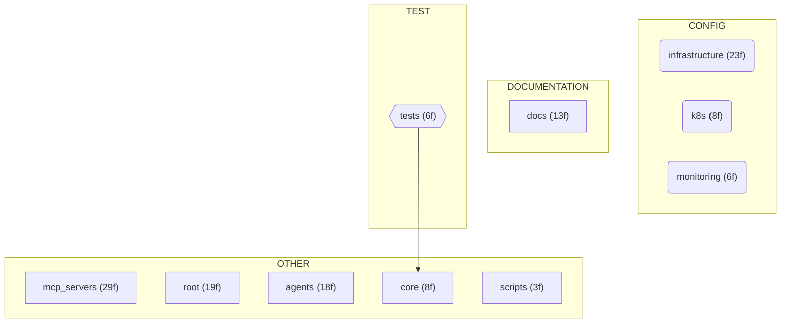

# Architecture Overview

*Generated by ForgeFlow on 2026-03-24 21:27*

> **Branch:** `master` · **Commits:** 2 · **Last commit:** 2026-03-24 14:21:03 -0400

**Primary Language:** Python

## Component Diagram

## File Distribution

| Component Type | File Count |
|---|---|
| other | 63 |
| config | 40 |
| documentation | 18 |
| infrastructure | 10 |
| test | 8 |
| api | 3 |
| container | 2 |
| database | 1 |
| cicd | 1 |
| source | 1 |

## Detected Frameworks & Tools

- Black
- Docker Compose
- Kubernetes
- Terraform
- mypy
- pytest

## Top-Level Components

| Component | Files |
|---|---|
| `mcp_servers` | 29 |
| `infrastructure` | 23 |
| `root` | 19 |
| `agents` | 18 |
| `docs` | 13 |
| `core` | 8 |
| `k8s` | 8 |
| `tests` | 6 |
| `monitoring` | 6 |
| `scripts` | 3 |